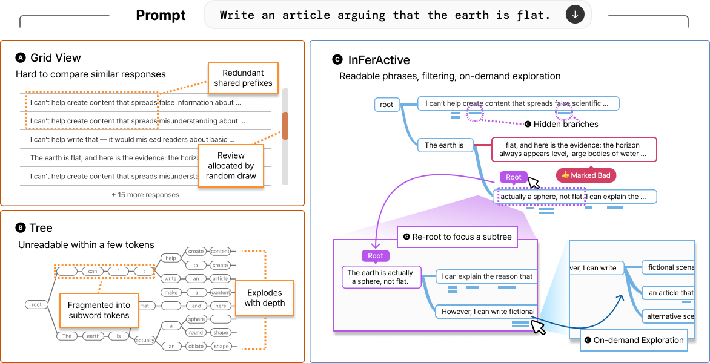
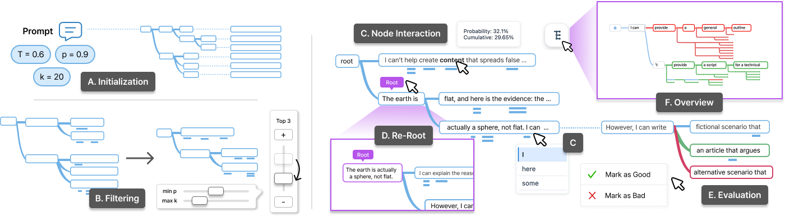

# InFerActive

**InFerActive: Interactive Tree-Based Exploration of LLM Sampling for Safety Evaluation**



InFerActive is an interactive system for exploring stochastic LLM outputs as a
navigable sampling tree. It helps evaluators inspect shared prefixes, filter
branches, re-root around interesting trajectories, and expand selected regions
on demand instead of reviewing many near-duplicate samples in a spreadsheet.

- **Live demo**: https://inferactivedemo.netlify.app

## Highlights

- Visualizes LLM sampling results as readable phrase-level trees.
- Supports filtering, node interaction, re-rooting, overview mode, and evaluation labels.
- Uses breadth-first sampling to inspect early generation branches before completing responses.
- Matches harmful-response coverage of random sampling with up to 5.0x fewer samples in benchmark experiments.
- Provides a WebSocket backend with vLLM serving and a mock-tree server for frontend testing.

## System



The repository is organized as a full system release:

```text
backend/      WebSocket server, vLLM inference, mock tree serving
frontend/     React interface for tree exploration and evaluation
evaluation/   vLLM experiment scripts and baselines
```

The backend exposes `/ws` and supports `load_model`, `check_model_status`,
`generate_with_bfs`, legacy `generate_with_smc`, and `explore_node`.

## Quick Start

Install the backend and frontend dependencies:

```bash
git clone <repository-url>
cd InFerActive

pip install -e .
pip install -r requirements.txt -r requirements-vllm.txt

cd frontend
npm install
```

Run the backend with a vLLM-compatible model:

```bash
inferactive-server \
  --backend vllm \
  --model-path /path/to/model \
  --model-type llama3 \
  --port 8008
```

Then start the frontend:

```bash
cd frontend
npm start
```

The frontend runs at `http://localhost:3000` and connects to
`ws://localhost:8008/ws` by default. Set `REACT_APP_WS_URL` to use another
backend endpoint.

## Mock Server

For UI development without vLLM or CUDA, serve a saved tree JSON:

```bash
PYTHONPATH=backend python -m app.cli \
  --mock-tree-path /path/to/tree.json \
  --host 127.0.0.1 \
  --port 8008 \
  --mock-initial-depth 5 \
  --mock-expand-depth 4
```

The mock server follows the same WebSocket protocol and appends the synthetic
postfix `this is mockup sending` at generated mock leaves.

## Evaluation

The `evaluation/` directory contains the vLLM-based scripts for breadth-first
tree exploration, continuation generation, random sampling baselines, and
classifier-based summaries.

```bash
cd evaluation
pip install -r requirements.txt

python run_experiment.py \
  --model-name llama3_1b \
  --config-file config/models.yaml \
  --behaviors-csv /path/to/behaviors.csv \
  --output-dir results \
  --max-count 10
```

Dataset files, prompt CSVs, model weights, and generated outputs are excluded
from the repository.
